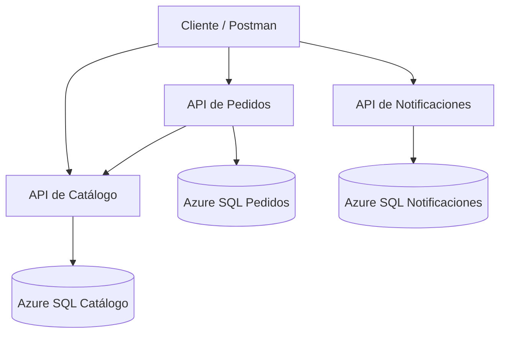

# MarketExpress

MarketExpress es una plataforma académica construida con arquitectura de microservicios para administrar un catálogo de productos, registrar pedidos y almacenar notificaciones.

Cada microservicio está organizado mediante N-Capas: API, Aplicación, Dominio e Infraestructura. Los servicios fueron desarrollados con .NET 9, desplegados individualmente en Azure App Service y conectados a bases de datos independientes en Azure SQL.

## Arquitectura



### Microservicios

| Microservicio | Responsabilidad |
|---|---|
| Catálogo | Crear, listar y consultar productos, además de reservar existencias |
| Pedidos | Validar productos mediante Catálogo, crear pedidos y consultar su estado |
| Notificaciones | Registrar, listar y consultar notificaciones asociadas a pedidos |

### Capas

Cada microservicio contiene cuatro proyectos:

- **API:** controladores, endpoints, Swagger y configuración de dependencias.
- **Aplicación:** servicios, casos de uso, DTOs e interfaces.
- **Dominio:** entidades y reglas de negocio.
- **Infraestructura:** Entity Framework Core, repositorios, DbContext y migraciones.

## Tecnologías

- .NET 9
- ASP.NET Core Web API
- Entity Framework Core 9
- SQL Server y Azure SQL
- Azure App Service
- Swagger / OpenAPI
- Postman
- Git y GitHub
- Docker para el ambiente local

## APIs desplegadas

| Servicio | URL | Swagger |
|---|---|---|
| Catálogo | https://marketexpress-catalogo-marlon2026.azurewebsites.net | [Abrir Swagger](https://marketexpress-catalogo-marlon2026.azurewebsites.net/swagger/index.html) |
| Pedidos | https://marketexpress-pedidos-marlon2026.azurewebsites.net | [Abrir Swagger](https://marketexpress-pedidos-marlon2026.azurewebsites.net/swagger/index.html) |
| Notificaciones | https://marketexpress-notificaciones-marlon2026.azurewebsites.net | [Abrir Swagger](https://marketexpress-notificaciones-marlon2026.azurewebsites.net/swagger/index.html) |

> Los servicios utilizan el nivel gratuito de Azure App Service. La primera solicitud puede tardar mientras la aplicación inicia después de un periodo de inactividad.

## Endpoints

### Catálogo

| Método | Endpoint | Descripción |
|---|---|---|
| POST | `/api/productos` | Crear un producto |
| GET | `/api/productos` | Listar productos |
| GET | `/api/productos/{id}` | Consultar un producto |
| POST | `/api/productos/{id}/reservar-stock` | Reservar existencias |

Reglas principales:

- El nombre es obligatorio.
- El precio debe ser mayor que cero.
- El stock no puede ser negativo.
- No se puede reservar una cantidad superior al stock disponible.

### Pedidos

| Método | Endpoint | Descripción |
|---|---|---|
| POST | `/api/pedidos` | Crear un pedido |
| GET | `/api/pedidos/{id}` | Consultar un pedido |

Al crear un pedido, el microservicio de Pedidos consulta el producto en Catálogo y solicita la reserva de existencias. Cada pedido nuevo queda con estado `Pendiente`.

### Notificaciones

| Método | Endpoint | Descripción |
|---|---|---|
| POST | `/api/notificaciones` | Crear una notificación |
| GET | `/api/notificaciones` | Listar notificaciones |
| GET | `/api/notificaciones/{id}` | Consultar una notificación |

## Bases de datos

Cada microservicio administra su propia base de datos:

- `MarketExpressCatalogo`
- `MarketExpressPedidos`
- `MarketExpressNotificaciones`

Las bases se encuentran en Azure SQL y sus estructuras fueron creadas mediante migraciones de Entity Framework Core.

Las cadenas de conexión se configuran mediante variables seguras en Azure App Service y no se almacenan en el repositorio.

## Ejecución local

### Requisitos

- .NET SDK 9
- SQL Server local o mediante Docker
- Git
- Postman

### Clonar el repositorio

```bash
git clone https://github.com/zendysalgado738-bit/MarketExpress.git
cd MarketExpress
```

### Restaurar y compilar

```bash
dotnet restore
dotnet build MarketExpress.sln
```

### Configuración

Las APIs esperan las siguientes cadenas de conexión:

- `ConnectionStrings:Catalogo`
- `ConnectionStrings:Pedidos`
- `ConnectionStrings:Notificaciones`

Pedidos también requiere la dirección de Catálogo:

- `Servicios:CatalogoUrl`

No se deben almacenar contraseñas directamente en el código ni subirlas al repositorio.

### Ejecutar una API

Ejemplo para Catálogo:

```bash
dotnet run --project src/Catalogo/MarketExpress.Catalogo.API
```

Las demás APIs pueden ejecutarse reemplazando el proyecto por el correspondiente a Pedidos o Notificaciones.

## Pruebas con Postman

La carpeta `postman` contiene:

- `MarketExpress.postman_collection.json`
- `MarketExpress.Azure.postman_environment.json`

### Importar y ejecutar

1. Abrir Postman.
2. Seleccionar **Import**.
3. Importar la colección y el environment.
4. Activar el environment `MarketExpress - Azure`.
5. Abrir el Collection Runner.
6. Ejecutar las solicitudes en el orden definido.

La colección utiliza variables dinámicas para enlazar el flujo:

1. Crea un producto y guarda su identificador.
2. Consulta y reserva stock.
3. Crea un producto para integración.
4. Crea un pedido y guarda su identificador.
5. Verifica el descuento de stock.
6. Crea una notificación asociada al pedido.
7. Consulta la notificación creada.

### Resultado validado

La colección completa fue ejecutada contra Azure con:

- **17 solicitudes**
- **55 pruebas automatizadas**
- **55 aprobadas**
- **0 fallidas**
- Casos exitosos y casos de error `400` y `404`

## Estructura general

```text
MarketExpress/
├── src/
│   ├── Catalogo/
│   │   ├── MarketExpress.Catalogo.API/
│   │   ├── MarketExpress.Catalogo.Aplicacion/
│   │   ├── MarketExpress.Catalogo.Dominio/
│   │   └── MarketExpress.Catalogo.Infraestructura/
│   ├── Pedidos/
│   │   ├── MarketExpress.Pedidos.API/
│   │   ├── MarketExpress.Pedidos.Aplicacion/
│   │   ├── MarketExpress.Pedidos.Dominio/
│   │   └── MarketExpress.Pedidos.Infraestructura/
│   └── Notificaciones/
│       ├── MarketExpress.Notificaciones.API/
│       ├── MarketExpress.Notificaciones.Aplicacion/
│       ├── MarketExpress.Notificaciones.Dominio/
│       └── MarketExpress.Notificaciones.Infraestructura/
├── postman/
├── MarketExpress.sln
└── README.md
```

## Equipo

Proyecto desarrollado por:

- Marlon Gutiérrez
- Valentino Mejia
- Francklin Chavez

## Estado del proyecto

- Microservicio de Catálogo completado.
- Microservicio de Pedidos completado.
- Microservicio de Notificaciones completado.
- Migraciones aplicadas en Azure SQL.
- APIs desplegadas en Azure App Service.
- Comunicación Pedidos → Catálogo validada.
- Colección Postman ejecutada sin pruebas fallidas.
